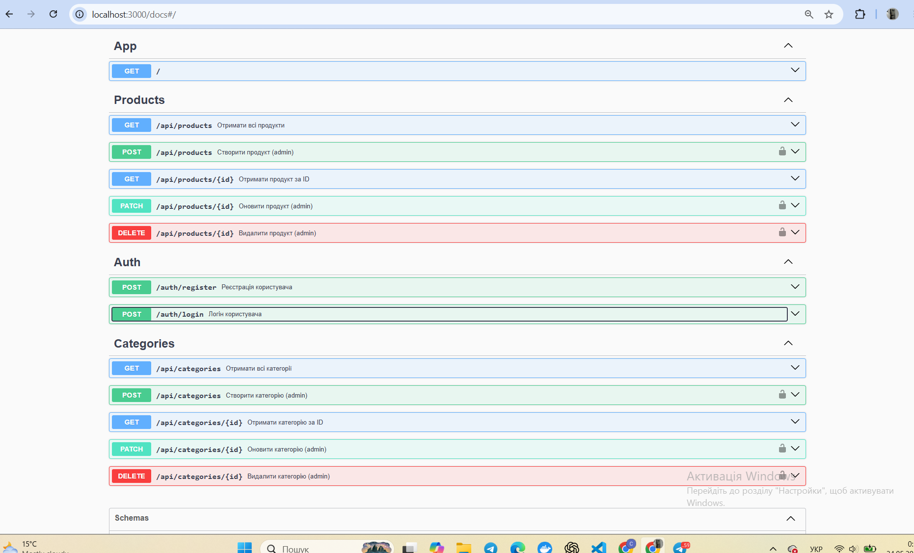

## practice1
PS C:\Users\user\Desktop\practice11> docker --version Docker version 29.2.1, build a5c7197 PS C:\Users\user\Desktop\practice11> docker compose version Docker Compose version v5.0.2 PS C:\Users\user\Desktop\practice11> docker run --rm hello-world

Hello from Docker! This message shows that your installation appears to be working correctly.

Student
Name: Софія Горбань
Group: <232/1>
3
docker compose up --build

✔ Image practice111-npm Built 1.3s ✔ Container practice111-npm-1 Recreated 0.2s Attaching to npm-1 npm-1 | 11.11.0 npm-1 exited with code 0

PS C:\Users\user\Desktop\practice11\practice111> docker compose run --rm npm npm -v Container practice111-npm-run-75ab37c7d19e Creating Container practice111-npm-run-75ab37c7d19e Created 11.11.0 PS C:\Users\user\Desktop\practice11\practice111> docker compose run --rm npm node --version Container practice111-npm-run-688177eb60b8 Creating Container practice111-npm-run-688177eb60b8 Created v25.8.0 PS C:\Users\user\Desktop\practice11\practice111>

### practice2  Практичне заняття №2 — NestJS + PostgreSQL + Redis
Student
Name: Софія Горбань
Group: <232/1>

## Опис
Проєкт демонструє налаштоване середовище розробки на базі:

- NestJS (backend)
- PostgreSQL (база даних)
- Redis (кешування)
- Docker + Docker Compose

---

## Структура репозиторію
src/ # NestJS source code
├── Dockerfile
├── docker-compose.yml
├── .env
├── .env.example
└── README.md

## Запуск проекту
cp .env.example .env
docker compose up --build
## Перевірка сервісів
ВПРАВА 1
docker compose run --rm app npm -v
[+]  2/2t 2/22
 ✔ Container practice111-redis-1    Running                                                                                                                0.0s
 ✔ Container practice111-postgres-1 Running                                                                                                                0.0s
Container practice111-postgres-1 Waiting 
Container practice111-redis-1 Waiting 
Container practice111-redis-1 Healthy 
Container practice111-postgres-1 Healthy 
Container practice111-app-run-6b37152f4b15 Creating 
Container practice111-app-run-6b37152f4b15 Created 
10.8.2


PS C:\Users\user\Desktop\practice11\practice111> docker compose run --rm app node --version
[+]  2/2t 2/22
 ✔ Container practice111-redis-1    Running                                                                                 0.0s
 ✔ Container practice111-postgres-1 Running                                                                                 0.0s
Container practice111-postgres-1 Waiting 
Container practice111-redis-1 Waiting 
Container practice111-redis-1 Healthy 
Container practice111-postgres-1 Healthy 
Container practice111-app-run-3a7157b03e1c Creating 
Container practice111-app-run-3a7157b03e1c Created 
v20.20.2  

C:\Users\user\Desktop\practice11\practice111> docker compose run --rm app nest --version
[+]  2/2t 2/22
 ✔ Container practice111-redis-1    Running                                                                                 0.0s
 ✔ Container practice111-postgres-1 Running                                                                                 0.0s
Container practice111-postgres-1 Waiting 
Container practice111-redis-1 Waiting 
Container practice111-redis-1 Healthy 
Container practice111-postgres-1 Healthy 
Container practice111-app-run-afbd4dad566f Creating 
Container practice111-app-run-afbd4dad566f Created 
11.0.21 

ВПРАВА 2
PS C:\Users\user\Desktop\practice11\practice111> docker compose ps
NAME                     IMAGE                COMMAND                  SERVICE    CREATED          STATUS                    PORTS
practice111-app-1        practice111-app      "docker-entrypoint.s…"   app        39 minutes ago   Up 6 minutes              0.0.0.0:3000->3000/tcp, [::]:3000->3000/tcp
practice111-postgres-1   postgres:16-alpine   "docker-entrypoint.s…"   postgres   45 minutes ago   Up 39 minutes (healthy)   0.0.0.0:5433->5432/tcp, [::]:5433->5432/tcp
practice111-redis-1      redis:7-alpine       "docker-entrypoint.s…"   redis      45 minutes ago   Up 39 minutes (healthy)   0.0.0.0:6380->6379/tcp, [::]:6380->6379/tcp


ВПРАВА 3

C:\Users\user\Desktop\practice11\practice111> curl http://localhost:3000 -UseBasicParsing
StatusCode        : 200
StatusDescription : OK
Content           : Hello World!
RawContent        : HTTP/1.1 200 OK
                    Connection: keep-alive
                    Keep-Alive: timeout=5
                    Content-Length: 12
                    Content-Type: text/html; charset=utf-8
                    Date: Sat, 04 Apr 2026 17:14:21 GMT
                    ETag: W/"c-Lve95gjOVATpfV8EL5X4nxwjKHE"...

ВПРАВА 4
[6:42:07 PM] Starting compilation in watch mode...
app-1  | 
app-1  | [6:42:10 PM] Found 0 errors. Watching for file changes.
app-1  | 
app-1  | [Nest] 34  - 04/26/2026, 6:42:12 PM     LOG [NestFactory] Starting Nest application...
app-1  | [Nest] 34  - 04/26/2026, 6:42:12 PM     LOG [InstanceLoader] TypeOrmModule dependencies initialized +90ms
app-1  | [Nest] 34  - 04/26/2026, 6:42:12 PM     LOG [InstanceLoader] ConfigHostModule dependencies initialized +0ms
app-1  | [Nest] 34  - 04/26/2026, 6:42:12 PM     LOG [InstanceLoader] AppModule dependencies initialized +0ms
app-1  | [Nest] 34  - 04/26/2026, 6:42:12 PM     LOG [InstanceLoader] ConfigModule dependencies initialized +0ms
app-1  | [Nest] 34  - 04/26/2026, 6:42:12 PM     LOG [InstanceLoader] CacheModule dependencies initialized +38ms
app-1  | [Nest] 34  - 04/26/2026, 6:42:12 PM     LOG [InstanceLoader] TypeOrmCoreModule dependencies initialized +69ms
app-1  | [Nest] 34  - 04/26/2026, 6:42:12 PM     LOG [RoutesResolver] AppController {/}: +4ms
app-1  | [Nest] 34  - 04/26/2026, 6:42:12 PM     LOG [RouterExplorer] Mapped {/, GET} route +4ms
app-1  | [Nest] 34  - 04/26/2026, 6:42:12 PM     LOG [NestApplication] Nest application successfully started +5ms
postgres-1  | 2026-04-26 18:45:44.321 UTC [55] LOG:  checkpoint starting: time
postgres-1  | 2026-04-26 18:45:48.559 UTC [55] LOG:  checkpoint complete: wrote 45 buffers (0.3%); 0 WAL file(s) added, 0 removed, 0 recycled; write=4.217 s, sync=0.011 s, total=4.240 s; sync files=12, longest=0.006 s, average=0.001 s; distance=260 kB, estimate=260 kB; lsn=0/195FC10, redo lsn=0/195FBD8


Використані технології
NestJS
TypeORM
PostgreSQL
Redis
Docker / Docker Compose
Node.js


ВПРАВА 5 
import { CacheModule } from '@nestjs/cache-manager';
import * as redisStore from 'cache-manager-redis-store';

@Module({
  imports: [
    CacheModule.registerAsync({
      useFactory: () => ({
        store: redisStore,
        host: process.env.REDIS_HOST,
        port: +process.env.REDIS_PORT,
      }),
    }),
  ],
})


ВПРАВА 6
 PS C:\Users\user\Desktop\practice11\practice111> docker compose exec postgres psql -U nestuser -d nestdb -c '\l'
                                                      List of databases
   Name    |  Owner   | Encoding | Locale Provider |  Collate   |   Ctype    | ICU Locale | ICU Rules |   Access privileges   
-----------+----------+----------+-----------------+------------+------------+------------+-----------+-----------------------
 nestdb    | nestuser | UTF8     | libc            | en_US.utf8 | en_US.utf8 |            |           | 
 postgres  | nestuser | UTF8     | libc            | en_US.utf8 | en_US.utf8 |            |           | 
 template0 | nestuser | UTF8     | libc            | en_US.utf8 | en_US.utf8 |            |           | =c/nestuser          +
           |          |          |                 |            |            |            |           | nestuser=CTc/nestuser
 template1 | nestuser | UTF8     | libc            | en_US.utf8 | en_US.utf8 |            |           | =c/nestuser          +
           |          |          |                 |            |            |            |           | nestuser=CTc/nestuser
(4 rows)

C:\Users\user\Desktop\practice11\practice111> docker compose exec redis redis-cli ping
PONG


## Практична 3 — CRUD REST API для MiniShop

Student
Name: Горбань Софія Сергіївна
Group: 232.1

Структура репозиторію
. ├── src/ │ ├── categories/ │ │ ├── category.entity.ts │ │ ├── categories.module.ts │ │ ├── categories.service.ts │ │ └── categories.controller.ts │ ├── products/ │ │ ├── product.entity.ts │ │ ├── products.module.ts │ │ ├── products.service.ts │ │ └── products.controller.ts │ ├── migrations/ │ │ ├── 1700000001-CreateTables.ts │ │ └── -AddIsActiveToProducts.ts │ ├── data-source.ts │ └── app.module.ts ├── Dockerfile ├── docker-compose.yml └── README.md

Запуск проекту
cp .env.example .env docker compose up --build

 PS C:\Users\user\Desktop\practice11\practice111> docker compose up --build -d
#1 [internal] load local bake definitions
#1 reading from stdin 547B 0.0s done
#1 DONE 0.0s

#2 [internal] load build definition from Dockerfile
#2 transferring dockerfile: 251B 0.0s done
#2 DONE 0.0s

#3 [auth] library/node:pull token for registry-1.docker.io
#3 DONE 0.0s

#4 [internal] load metadata for docker.io/library/node:20-alpine
#4 DONE 2.2s

#5 [internal] load .dockerignore
#5 transferring context: 2B done
#5 DONE 0.0s

#6 [1/6] FROM docker.io/library/node:20-alpine@sha256:fb4cd12c85ee03686f6af5362a0b0d56d50c58a04632e6c0fb8363f609372293
#6 resolve docker.io/library/node:20-alpine@sha256:fb4cd12c85ee03686f6af5362a0b0d56d50c58a04632e6c0fb8363f609372293 0.0s done
#6 DONE 0.0s

#7 [internal] load build context
#7 transferring context: 3.24MB 2.0s done
#7 DONE 2.1s

#8 [2/6] RUN npm install -g @nestjs/cli
#8 CACHED

#9 [3/6] WORKDIR /app
#9 CACHED

#10 [4/6] COPY package*.json ./
#10 CACHED

#11 [5/6] RUN npm install --ignore-scripts 2>/dev/null || true
#11 CACHED

#12 [6/6] COPY . .
#12 DONE 5.5s

#13 exporting to image
#13 exporting layers
#13 exporting layers 9.6s done
#13 exporting manifest sha256:cb3ca99e2288b3d54bead6753a7a85d161a162de5666b8dba8297367272428ce 0.0s done
#13 exporting config sha256:69a02a38b20ce80b3326e547c2744cb515240731e097d12f45953af31d911f76 0.0s done
#13 exporting attestation manifest sha256:811795b52ce2b12bc801df61c2b47babf15571dc7f7b33843a0505a901eaca8c
#13 exporting attestation manifest sha256:811795b52ce2b12bc801df61c2b47babf15571dc7f7b33843a0505a901eaca8c 0.1s done
#13 exporting manifest list sha256:2ef4cec1b9edfe8767131859afbbfa9653394077f0df900f08daaa26ef3d0306 0.0s done
#13 naming to docker.io/library/practice111-app:latest done
#13 unpacking to docker.io/library/practice111-app:latest
#13 unpacking to docker.io/library/practice111-app:latest 4.3s done
#13 DONE 14.2s

#14 resolving provenance for metadata file
#14 DONE 0.0s
[+] up 6/6
 ✔ Image practice111-app            Built                                                                                  24.9s
 ✔ Network practice111_nestnet      Created                                                                                0.1s
 ✔ Volume practice111_postgres_data Created                                                                                0.0s
 ✔ Container practice111-redis-1    Healthy                                                                                20.8s
 ✔ Container practice111-postgres-1 Healthy                                                                                20.8s
 ✔ Container practice111-app-1      Created  

 PS C:\Users\user\Desktop\practice11\practice111> docker compose run --rm app npm run migration:generate -- src/migrations/InitTables
[+]  2/2t 2/22
 ✔ Container practice111-redis-1    Running                                                                                 0.0s
 ✔ Container practice111-postgres-1 Running                                                                                 0.0s
Container practice111-redis-1 Waiting 
Container practice111-postgres-1 Waiting 
Container practice111-postgres-1 Healthy 
Container practice111-redis-1 Healthy 
Container practice111-app-run-97427826f35b Creating 
Container practice111-app-run-97427826f35b Created 

> app@0.0.1 migration:generate
> npm run typeorm -- migration:generate -d src/data-source.ts src/migrations/InitTables


> app@0.0.1 typeorm
> ts-node -r tsconfig-paths/register ./node_modules/typeorm/cli.js migration:generate -d src/data-source.ts src/migrations/InitTables

Migration /app/src/migrations/1777233207431-InitTables.ts has been generated successfully.
[11:33:46 AM] Starting compilation in watch mode...
app-1       | 
app-1       | [11:33:50 AM] Found 0 errors. Watching for file changes.
app-1       | 
app-1       | [Nest] 34  - 04/27/2026, 11:33:50 AM     LOG [NestFactory] Starting Nest application...
app-1       | [Nest] 34  - 04/27/2026, 11:33:50 AM     LOG [InstanceLoader] TypeOrmModule dependencies initialized +67ms
app-1       | [Nest] 34  - 04/27/2026, 11:33:50 AM     LOG [InstanceLoader] ConfigHostModule dependencies initialized +1ms
app-1       | [Nest] 34  - 04/27/2026, 11:33:50 AM     LOG [InstanceLoader] AppModule dependencies initialized +0ms
app-1       | [Nest] 34  - 04/27/2026, 11:33:50 AM     LOG [InstanceLoader] ConfigModule dependencies initialized +0ms
app-1       | [Nest] 34  - 04/27/2026, 11:33:51 AM     LOG [InstanceLoader] CacheModule dependencies initialized +24ms
app-1       | [Nest] 34  - 04/27/2026, 11:33:51 AM     LOG [InstanceLoader] TypeOrmCoreModule dependencies initialized +69ms
app-1       | [Nest] 34  - 04/27/2026, 11:33:51 AM     LOG [RoutesResolver] AppController {/}: +4ms
app-1       | [Nest] 34  - 04/27/2026, 11:33:51 AM     LOG [RouterExplorer] Mapped {/, GET} route +3ms
app-1       | [Nest] 34  - 04/27/2026, 11:33:51 AM     LOG [NestApplication] Nest application successfully started +3ms
postgres-1  | 2026-04-27 11:38:51.663 UTC [28] LOG:  checkpoint starting: time
postgres-1  | 2026-04-27 11:38:51.677 UTC [28] LOG:  checkpoint complete: wrote 3 buffers (0.0%); 0 WAL file(s) added, 0 removed, 0 recycled; write=0.004 s, sync=0.002 s, total=0.014 s; sync files=2, longest=0.001 s, average=0.001 s; distance=0 kB, estimate=0 kB; lsn=0/1989510, redo lsn=0/19894D8 

API Endpoints
Method	URL	Опис
GET	/api/categories	Список категорій
GET	/api/categories/:id	Одна категорія
POST	/api/categories	Створити категорію
PATCH	/api/categories/:id	Оновити категорію
DELETE	/api/categories/:id	Видалити категорію
GET	/api/products	Список продуктів
GET	/api/products/:id	Один продукт
POST	/api/products	Створити продукт
PATCH	/api/products/:id	Оновити продукт
DELETE	/api/products/:id	Видалити продукт

## Тест створення категорії

PS C:\Users\user\Desktop\practice11\practice111> docker compose exec postgres psql -U nestuser -d nestdb -c "\dt"
           List of relations
 Schema |    Name    | Type  |  Owner   
--------+------------+-------+----------
 public | migrations | table | nestuser
(1 row)

## Тест створення продукту

StatusCode        : 200
StatusDescription : OK
Content           : [{"id":1,"isActive":true,"name":"iPhone16","de
                    scription":null,"price":"999.00","stock":0,"
                    category":{"id":1,"name":"Electronics","desc
                    ription":null,"createdAt":"2026-04-27T17:30:
                    32.186Z"},"createdAt":"2..}]

### Тест 404

PS C:\Users\user\Desktop\practice11\practice111> curl http://localhost:3000/api/products/999
curl : {"message":"Product #999 not found","error":"Not Found","
statusCode":404}

## Практичне заняття №4 — DTO + class-validator + Pipes
 
### Структура репозиторію
 ## Student
- Name: <Горбань Софія>
- Group: <232.1>
.
├── src/
│   ├── categories/
│   │   ├── dto/
│   │   │   ├── create-category.dto.ts
│   │   │   └── update-category.dto.ts
│   │   ├── category.entity.ts
│   │   ├── categories.module.ts
│   │   ├── categories.service.ts
│   │   └── categories.controller.ts
│   ├── products/
│   │   ├── dto/
│   │   │   ├── create-product.dto.ts
│   │   │   └── update-product.dto.ts
│   │   ├── product.entity.ts
│   │   ├── products.module.ts
│   │   ├── products.service.ts
│   │   └── products.controller.ts
│   ├── common/
│   │   └── pipes/
│   │   	└── trim.pipe.ts
│   ├── migrations/
│   ├── data-source.ts
│   ├── main.ts
│   └── app.module.ts
├── Dockerfile
├── docker-compose.yml
└── README.md

### Запуск проекту
bash
cp .env.example .env
docker compose up --build


## Валідна категорія
PS C:\Users\user\Desktop\practice11\practice111> Invoke-RestMethod -Uri "http://localhost:3000/api/categories" `  -Method POST `  -ContentType "application/json" `  -Body '{"name":"Electronics","description":"Gadgets"}'

id name        description createdAt               
-- ----        ----------- ---------               
 1 Electronics Gadgets     2026-05-22T11:34:14.244Z


## Порожнє ім’я
PS C:\Users\user\Desktop\practice11\practice111> Invoke-RestMethod -Uri "http://localhost:3000/api/categories" `  -Method POST `  -ContentType "application/json" `  -Body '{"name":""}'
Invoke-RestMethod : {"message":["name must be longer than or equal to 2 characters"],"error":"Bad Request","statusCode":400}
At line:1 char:1
+ Invoke-RestMethod -Uri "http://localhost:3000/api/categories" `  -Met ...
+ ~~~~~~~~~~~~~~~~~~~~~~~~~~~~~~~~~~~~~~~~~~~~~~~~~~~~~~~~~~~~~~~~~~~~~
    + CategoryInfo          : InvalidOperation: (System.Net.HttpWebRequest:HttpWebRequest) [Invoke-RestMethod], WebException
    + FullyQualifiedErrorId : WebCmdletWebResponseException,Microsoft.PowerShell.Commands.InvokeRestMethodCommand

## Без name
PS C:\Users\user\Desktop\practice11\practice111> Invoke-RestMethod -Uri "http://localhost:3000/api/categories" `  -Method POST `  -ContentType "application/json" `  -Body '{"description":"Some text"}'
Invoke-RestMethod : {"message":["name must be shorter than or equal to 100 characters","name must be longer than or equal to 2 character
s","name must be a string"],"error":"Bad Request","statusCode":400}
At line:1 char:1
+ Invoke-RestMethod -Uri "http://localhost:3000/api/categories" `  -Met ...
+ ~~~~~~~~~~~~~~~~~~~~~~~~~~~~~~~~~~~~~~~~~~~~~~~~~~~~~~~~~~~~~~~~~~~~~
    + CategoryInfo          : InvalidOperation: (System.Net.HttpWebRequest:HttpWebRequest) [Invoke-RestMethod], WebException
    + FullyQualifiedErrorId : WebCmdletWebResponseException,Microsoft.PowerShell.Commands.InvokeRestMethodCommand

## Зайве поле (forbidNonWhitelisted)
    PS C:\Users\user\Desktop\practice11\practice111> Invoke-RestMethod -Uri "http://localhost:3000/api/categories" `  -Method POST `  -ContentType "application/json" `  -Body '{"name":"Test","isAdmin":true}'
Invoke-RestMethod : {"message":["property isAdmin should not exist"],"error":"Bad Request","statusCode":400}
At line:1 char:1
+ Invoke-RestMethod -Uri "http://localhost:3000/api/categories" `  -Met ...
+ ~~~~~~~~~~~~~~~~~~~~~~~~~~~~~~~~~~~~~~~~~~~~~~~~~~~~~~~~~~~~~~~~~~~~~
    + CategoryInfo          : InvalidOperation: (System.Net.HttpWebRequest:HttpWebRequest) [Invoke-RestMethod], WebException
    + FullyQualifiedErrorId : WebCmdletWebResponseException,Microsoft.PowerShell.Commands.InvokeRestMethodCommand

## Валідний продукт
    PS C:\Users\user\Desktop\practice11\practice111> Invoke-RestMethod -Uri "http://localhost:3000/api/products" `  -Method POST `  -ContentType "application/json" `  -Body '{"name":"iPhone 16","price":999.99,"stock":50,"categoryId":1}'


id          : 1
isActive    : True
name        : iPhone 16
description : 
price       : 999,99
stock       : 50
category    : @{id=1}
createdAt   : 2026-05-22T11:38:52.076Z
updatedAt   : 2026-05-22T11:38:52.076Z

## Від’ємна ціна
PS C:\Users\user\Desktop\practice11\practice111> Invoke-RestMethod -Uri "http://localhost:3000/api/products" `  -Method POST `  -ContentType "application/json" `  -Body '{"name":"Bad Product","price":-5}'
Invoke-RestMethod : {"message":["price must not be less than 0.01"],"error":"Bad Request","statusCode":400}
At line:1 char:1
+ Invoke-RestMethod -Uri "http://localhost:3000/api/products" `  -Metho ...
+ ~~~~~~~~~~~~~~~~~~~~~~~~~~~~~~~~~~~~~~~~~~~~~~~~~~~~~~~~~~~~~~~~~~~~~
    + CategoryInfo          : InvalidOperation: (System.Net.HttpWebRequest:HttpWebRequest) [Invoke-RestMethod], WebException
    + FullyQualifiedErrorId : WebCmdletWebResponseException,Microsoft.PowerShell.Commands.InvokeRestMethodCommand

## Кілька помилок
PS C:\Users\user\Desktop\practice11\practice111> Invoke-RestMethod -Uri "http://localhost:3000/api/products" `  -Method POST `  -ContentType "application/json" `  -Body '{"name":"","price":-5,"stock":-10}'
Invoke-RestMethod : {"message":["name must be longer than or equal to 2 characters","price must not be less than 0.01","stock must not b
e less than 0"],"error":"Bad Request","statusCode":400}
At line:1 char:1
+ Invoke-RestMethod -Uri "http://localhost:3000/api/products" `  -Metho ...
+ ~~~~~~~~~~~~~~~~~~~~~~~~~~~~~~~~~~~~~~~~~~~~~~~~~~~~~~~~~~~~~~~~~~~~~
    + CategoryInfo          : InvalidOperation: (System.Net.HttpWebRequest:HttpWebRequest) [Invoke-RestMethod], WebException
    + FullyQualifiedErrorId : WebCmdletWebResponseException,Microsoft.PowerShell.Commands.InvokeRestMethodCommand   

## PATCH
 PS C:\Users\user\Desktop\practice11\practice111> Invoke-RestMethod -Uri "http://localhost:3000/api/products/1" `  -Method PATCH `  -ContentType "application/json" `  -Body '{"price":899.99}'


id          : 1
isActive    : True
name        : iPhone 16
description : 
price       : 899,99
stock       : 50
category    : @{id=1; name=Electronics; description=Gadgets; createdAt=2026-05-22T11:34:14.244Z}
createdAt   : 2026-05-22T11:38:52.076Z
updatedAt   : 2026-05-22T14:25:18.242Z

 ## Порожній PATCH
    PS C:\Users\user\Desktop\practice11\practice111> Invoke-RestMethod -Uri "http://localhost:3000/api/products/1" `  -Method PATCH `  -ContentType "application/json" `  -Body '{}'


id          : 1
isActive    : True
name        : iPhone 16
description : 
price       : 899.99
stock       : 50
category    : @{id=1; name=Electronics; description=Gadgets; createdAt=2026-05-22T11:34:14.244Z}
createdAt   : 2026-05-22T11:38:52.076Z
updatedAt   : 2026-05-22T11:39:56.204Z

### Тест TrimPipe
PS C:\Users\user\Desktop\practice11\practice111> Invoke-RestMethod -Uri "http://localhost:3000/api/categories" `  -Method POST `  -ContentType "application/json" `  -Body '{"name":"  Accessories  "}'

id name            description createdAt               
-- ----            ----------- ---------               
 2   Accessories               2026-05-22T11:56:39.705Z


 

## Student
- Name: Горбань Софія Сергіївна
- 232.1

## Практичне заняття №5 — JWT Authentication + Guards + RBAC

├── src/
│ ├── auth/
│ │ ├── dto/
│ │ │ ├── register.dto.ts
│ │ │ └── login.dto.ts
│ │ ├── auth.module.ts
│ │ ├── auth.service.ts
│ │ └── auth.controller.ts
│ ├── users/
│ │ ├── user.entity.ts
│ │ ├── users.module.ts
│ │ └── users.service.ts
│ ├── common/
│ │ ├── enums/
│ │ │ └── role.enum.ts
│ │ ├── guards/
│ │ │ ├── jwt-auth.guard.ts
│ │ │ └── roles.guard.ts
│ │ ├── decorators/
│ │ │ ├── current-user.decorator.ts
│ │ │ └── roles.decorator.ts
│ │ └── pipes/
│ │ └── trim.pipe.ts
│ ├── categories/
│ ├── products/
│ ├── migrations/
│ ├── data-source.ts
│ ├── main.ts
│ └── app.module.ts
├── Dockerfile
├── docker-compose.yml
└── README.md

PS C:\Users\user\Desktop\practice11\practice111> docker compose up --build -d
#1 [internal] load local bake definitions
#1 reading from stdin 547B 0.0s done
#1 DONE 0.0s

#2 [internal] load build definition from Dockerfile
#2 transferring dockerfile: 251B done
#2 DONE 0.0s

#3 [auth] library/node:pull token for registry-1.docker.io
#3 DONE 0.0s

#4 [internal] load metadata for docker.io/library/node:20-alpine
#4 DONE 1.0s

#5 [internal] load .dockerignore
#5 transferring context: 2B done
#5 DONE 0.0s

#6 [1/6] FROM docker.io/library/node:20-alpine@sha256:fb4cd12c85ee03686f6af5362a0b0d56d50c58a04632e6c0fb8363f609372293
#6 resolve docker.io/library/node:20-alpine@sha256:fb4cd12c85ee03686f6af5362a0b0d56d50c58a04632e6c0fb8363f609372293 0.0s done
#6 DONE 0.0s

#7 [internal] load build context
#7 transferring context: 3.46MB 2.3s done
#7 DONE 2.4s

#8 [2/6] RUN npm install -g @nestjs/cli
#8 CACHED

#9 [3/6] WORKDIR /app
#9 CACHED

#10 [4/6] COPY package*.json ./
#10 CACHED

#11 [5/6] RUN npm install --ignore-scripts 2>/dev/null || true
#11 CACHED

#12 [6/6] COPY . .
#12 DONE 4.7s

#13 exporting to image
#13 exporting layers
#13 exporting layers 8.6s done
#13 exporting manifest sha256:c67a8eb95a5c2279da7678dacab053bc76e547174a49dba48159fef3d0d2c3ba 0.0s done
#13 exporting config sha256:649885f9c3c764542dfbdb0ce2bb15ac9fb013dfe83d450fba111fd7ca4d1ce4 0.0s done
#13 exporting attestation manifest sha256:27dcf30050bb2166edf3c2fa4410a636e83084b4434475aad334133fc6605909 0.0s done
#13 exporting manifest list sha256:ff7a2141026c0c9ee9b87502f3485b1ac7c65d67fa0ec4674f52b8b8a09657b4 0.0s done
#13 naming to docker.io/library/practice111-app:latest done
#13 unpacking to docker.io/library/practice111-app:latest
#13 unpacking to docker.io/library/practice111-app:latest 8.0s done
#13 DONE 16.8s

#14 resolving provenance for metadata file
#14 DONE 0.0s
[+] up 4/4
 ✔ Image practice111-app            Built                                                                                           24.9s
 ✔ Container practice111-redis-1    Healthy                                                                                         3.4s
 ✔ Container practice111-postgres-1 Healthy                                                                                         3.4s
 ✔ Container practice111-app-1      Recreated     


##  API Endpoints
| Method | URL | Auth | Role |
|--------|-----|------|------|
| POST | /auth/register | - | - |
| POST | /auth/login | - | - |
| GET | /api/categories | - | - |
| POST | /api/categories | JWT | admin |
| GET | /api/products | - | - |
| POST | /api/products | JWT | admin |
| PATCH | /api/products/:id | JWT | admin |
| DELETE | /api/products/:id | JWT | admin |


PS C:\Users\user\Desktop\practice11\practice111> docker compose exec postgres psql -U nestuser -d nestdb -c "\d users"
                                         Table "public.users"
    Column    |            Type             | Collation | Nullable |              Default              
--------------+-----------------------------+-----------+----------+-----------------------------------
 id           | integer                     |           | not null | nextval('users_id_seq'::regclass)
 email        | character varying           |           | not null | 
 passwordHash | character varying           |           | not null | 
 name         | character varying(100)      |           |          | 
 role         | users_role_enum             |           | not null | 'user'::users_role_enum
 createdAt    | timestamp without time zone |           | not null | now()
Indexes:
    "PK_users_id" PRIMARY KEY, btree (id)
    "UQ_users_email" UNIQUE CONSTRAINT, btree (email)


## 1.  Реєстрація нового користувача:
    PS C:\Users\user\Desktop\practice11\practice111> Invoke-RestMethod -Method Post `  -Uri "http://localhost:3000/auth/register" `  -ContentType "application/json" `  -Body '{"email":"admin@test.com","password":"password123","name":"Admin"}'


id        : 1
email     : admin@test.com
name      : Admin
role      : user
createdAt : 2026-05-23T13:19:24.860Z

## 2. Повторна реєстрація (дубль email):
PS C:\Users\user\Desktop\practice11\practice111> Invoke-RestMethod -Method POST http://localhost:3000/auth/register `-Headers @{ "Content-Type" = "application/json" } `-Body '{"email":"user@test.com","password":"otherpass123"}'
Invoke-RestMethod : A positional parameter cannot be found that accepts argument '-Headers'.
At line:1 char:1
+ Invoke-RestMethod -Method POST http://localhost:3000/auth/register `- ...
+ ~~~~~~~~~~~~~~~~~~~~~~~~~~~~~~~~~~~~~~~~~~~~~~~~~~~~~~~~~~~~~~~~~~~~~
    + CategoryInfo          : InvalidArgument: (:) [Invoke-RestMethod], ParameterBindingException
    + FullyQualifiedErrorId : PositionalParameterNotFound,Microsoft.PowerShell.Commands.InvokeRestMethodCommand


## 3.  Логін і збереження токену : 
PS C:\Users\user\Desktop\practice11\practice111> Invoke-RestMethod -Method Post `  -Uri "http://localhost:3000/auth/login" `  -ContentType "application/json" `  -Body '{"email":"admin@test.com","password":"password123"}'

accessToken                                                                                                                             
-----------                                                                                                                             
eyJhbGciOiJIUzI1NiIsInR5cCI6IkpXVCJ9.eyJzdWIiOjEsImVtYWlsIjoiYWRtaW5AdGVzdC5jb20iLCJyb2xlIjoidXNlciIsImlhdCI6MTc3OTU0MjQzNywiZXhwIjox...

## 4. Невірний пароль:
PS C:\Users\user\Desktop\practice11\practice111> Invoke-RestMethod -Method POST http://localhost:3000/auth/login `-Headers @{ "Content-Type" = "application/json" } `-Body '{"email":"user@test.com","password":"wrongpassword"}'
Invoke-RestMethod : A positional parameter cannot be found that accepts argument '-Headers'.
At line:1 char:1
+ Invoke-RestMethod -Method POST http://localhost:3000/auth/login `-Hea ...
+ ~~~~~~~~~~~~~~~~~~~~~~~~~~~~~~~~~~~~~~~~~~~~~~~~~~~~~~~~~~~~~~~~~~~~~
    + CategoryInfo          : InvalidArgument: (:) [Invoke-RestMethod], ParameterBindingException
    + FullyQualifiedErrorId : PositionalParameterNotFound,Microsoft.PowerShell.Commands.InvokeRestMethodCommand

## 5. GET без токена (публічний):
PS C:\Users\user\Desktop\practice11\practice111> curl http://localhost:3000/api/products

Security Warning: Script Execution Risk
Invoke-WebRequest parses the content of the web page. Script code in the web page might be run when the page is parsed.
      RECOMMENDED ACTION:
      Use the -UseBasicParsing switch to avoid script code execution.

      Do you want to continue?
    
[Y] Yes  [A] Yes to All  [N] No  [L] No to All  [S] Suspend  [?] Help (default is "N"): Y


StatusCode        : 200
StatusDescription : OK
Content           : []
RawContent        : HTTP/1.1 200 OK
                    Connection: keep-alive
                    Keep-Alive: timeout=5
                    Content-Length: 2
                    Content-Type: application/json; charset=utf-8
                    Date: Sat, 23 May 2026 14:20:32 GMT
                    ETag: W/"2-l9Fw4VUO7kr8CvBlt4zaMC...
Forms             : {}
Headers           : {[Connection, keep-alive], [Keep-Alive, timeout=5], [Content-Length, 2], [Content-Type, application/json; charset=ut
                    f-8]...}
Images            : {}
InputFields       : {}
Links             : {}
ParsedHtml        : System.__ComObject
RawContentLength  : 2

## 6. POST без токена
PS C:\Users\user\Desktop\practice11\practice111> Invoke-RestMethod -Method POST "http://localhost:3000/api/products" -Headers @{ "Content-Type" = "application/json" } -Body '{"name":"Hacked Product","price":1}'
Invoke-RestMethod : {"message":"Missing authorization token","error":"Unauthorized","statusCode":401}
At line:1 char:1
+ Invoke-RestMethod -Method POST "http://localhost:3000/api/products" - ...
+ ~~~~~~~~~~~~~~~~~~~~~~~~~~~~~~~~~~~~~~~~~~~~~~~~~~~~~~~~~~~~~~~~~~~~~
    + CategoryInfo          : InvalidOperation: (System.Net.HttpWebRequest:HttpWebRequest) [Invoke-RestMethod], WebException
    + FullyQualifiedErrorId : WebCmdletWebResponseException,Microsoft.PowerShell.Commands.InvokeRestMethodCommand
 
## 7. POST з токеном USER (не admin):
PS C:\Users\user\Desktop\practice11\practice111> Invoke-RestMethod -Uri "http://localhost:3000/api/products" `
>> -Method POST `
>> -Headers @{Authorization="Bearer $userToken"} `
>> -ContentType "application/json" `
>> -Body '{"name":"Blocked Product","price":99}'
Invoke-RestMethod : {"message":"Insufficient permissions","error":"Forbidden","statusCo
de":403}
At line:1 char:1
+ Invoke-RestMethod -Uri "http://localhost:3000/api/products" `
+ ~~~~~~~~~~~~~~~~~~~~~~~~~~~~~~~~~~~~~~~~~~~~~~~~~~~~~~~~~~~~~
    + CategoryInfo          : InvalidOp

## 8. POST з токеном ADMIN:
PS C:\Users\user\Desktop\practice11\practice111> Invoke-RestMethod -Method POST "http://localhost:3000/api/products" -Headers @{ "Content-Type"="application/json"; "Authorization"="Bearer $adminToken" } -Body '{"name":"MacBook Pro","price":2499.99,"stock":10}'


id          : 1
isActive    : True
name        : MacBook Pro
description : 
price       : 2499,99
stock       : 10
createdAt   : 2026-05-23T14:40:26.121Z
updatedAt   : 2026-05-23T14:40:26.121Z

## Student
- Name: <Горбань Софія>
- Group: <232.1>
 
## Практичне заняття №6 — Interceptors + Exception Filters + Swagger
 
### Структура репозиторію
```
.
├── src/
│   ├── auth/ ...
│   ├── users/ ...
│   ├── categories/ ...
│   ├── products/ ...
│   ├── common/
│   │   ├── enums/
│   │   │   └── role.enum.ts
│   │   ├── guards/
│   │   │   ├── jwt-auth.guard.ts
│   │   │   └── roles.guard.ts
│   │   ├── decorators/
│   │   │   ├── current-user.decorator.ts
│   │   │   └── roles.decorator.ts
│   │   ├── interceptors/
│   │   │   ├── logging.interceptor.ts
│   │   │   └── transform.interceptor.ts
│   │   ├── filters/
│   │   │   └── http-exception.filter.ts
│   │   └── pipes/
│   │   	└── trim.pipe.ts
│   ├── migrations/
│   ├── main.ts
│   └── app.module.ts
├── swagger-screenshot.png
├── Dockerfile
├── docker-compose.yml
└── README.md
```
 
### Запуск проекту
```bash
cp .env.example .env
docker compose up --build
```
## Вправа 1
PS C:\Users\user\Desktop\practice11\practice111> Invoke-WebRequest http://localhost:3000/api/products

Security Warning: Script Execution Risk
Invoke-WebRequest parses the content of the web page. Script code in the web page might be run when the page is parsed.
      RECOMMENDED ACTION:
      Use the -UseBasicParsing switch to avoid script code execution.

      Do you want to continue?
    
[Y] Yes  [A] Yes to All  [N] No  [L] No to All  [S] Suspend  [?] Help (default is "N"): Y


StatusCode        : 200
StatusDescription : OK
Content           : []
RawContent        : HTTP/1.1 200 OK
                    Connection: keep-alive
                    Keep-Alive: timeout=5
                    Content-Length: 2
                    Content-Type: application/json; charset=utf-8
                    Date: Sat, 23 May 2026 17:06:50 GMT
                    ETag: W/"2-l9Fw4VUO7kr8CvBlt4zaMC...
Forms             : {}
Headers           : {[Connection, keep-alive], [Keep-Alive, timeout=5], [Content-Length, 2], [Content-Type, application/json; charset=ut
                    f-8]...}
Images            : {}
InputFields       : {}
Links             : {}
ParsedHtml        : System.__ComObject
RawContentLength  : 2


PS C:\Users\user\Desktop\practice11\practice111> docker compose logs --tail=5 app
app-1  | [Nest] 34  - 05/23/2026, 5:06:34 PM     LOG [RouterExplorer] Mapped {/api/categories, POST} route +0ms
app-1  | [Nest] 34  - 05/23/2026, 5:06:34 PM     LOG [RouterExplorer] Mapped {/api/categories/:id, PATCH} route +0ms
app-1  | [Nest] 34  - 05/23/2026, 5:06:34 PM     LOG [RouterExplorer] Mapped {/api/categories/:id, DELETE} route +1ms
app-1  | [Nest] 34  - 05/23/2026, 5:06:34 PM     LOG [NestApplication] Nest application successfully started +4ms
app-1  | [Nest] 34  - 05/23/2026, 5:06:50 PM     LOG [HTTP] GET /api/products — 200 — 26ms

## Вправа 2
PS C:\Users\user\Desktop\practice11\practice111> Invoke-WebRequest http://localhost:3000/api/products                                    

Security Warning: Script Execution Risk
Invoke-WebRequest parses the content of the web page. Script code in the web page might be run when the page is parsed.
      RECOMMENDED ACTION:
      Use the -UseBasicParsing switch to avoid script code execution.

      Do you want to continue?
    
[Y] Yes  [A] Yes to All  [N] No  [L] No to All  [S] Suspend  [?] Help (default is "N"): Y


StatusCode        : 200
StatusDescription : OK
Content           : {"data":[],"statusCode":200,"timestamp":"2026-05-23T17:15:47.389Z"}
RawContent        : HTTP/1.1 200 OK
                    Connection: keep-alive
                    Keep-Alive: timeout=5
                    Content-Length: 67
                    Content-Type: application/json; charset=utf-8
                    Date: Sat, 23 May 2026 17:15:47 GMT
                    ETag: W/"43-zBbVwJBbn4TUJfNxOPyC...
Forms             : {}
Headers           : {[Connection, keep-alive], [Keep-Alive, timeout=5], [Content-Length, 67], [Content-Type, application/json; charset=u
                    tf-8]...}
Images            : {}
InputFields       : {}
Links             : {}
ParsedHtml        : System.__ComObject
RawContentLength  : 67

### Swagger UI
http://localhost:3000/api/docs
 

### Формат успішної відповіді
{
  "data": {},
  "statusCode": 201,
  "timestamp": "2026-05-23T21:26:00.270Z"
}
Response headers
 connection: keep-alive 
 content-length: 67 
 content-type: application/json; charset=utf-8 
 date: Sat,23 May 2026 21:26:00 GMT 
 etag: W/"43-pO8sB5TDwXmZJ5fXN3oG07LKZvA" 
 keep-alive: timeout=5 
 x-powered-by: Express 

 
### Формат помилки

 {
  "error": {
    "code": 400,
    "message": "Validation failed",
    "details": [
      "name must be longer than or equal to 2 characters",
      "price must not be less than 0.01"
    ],
    "traceId": "85894379-84df-4852-abe3-a30f54bd49ea"
  },
  "timestamp": "2026-05-23T21:34:31.201Z"
}
Response headers
 connection: keep-alive 
 content-length: 239 
 content-type: application/json; charset=utf-8 
 date: Sat,23 May 2026 21:34:31 GMT 
 etag: W/"ef-6HziDU4PDcLyzPBRwF9gueht7N8" 
 keep-alive: timeout=5 
 x-powered-by: Express 

### Приклад логів (LoggingInterceptor)


[9:39:56 PM] Starting compilation in watch mode...
app-1  | 
app-1  | [9:40:00 PM] Found 0 errors. Watching for file changes.
app-1  | 
app-1  | [Nest] 34  - 05/23/2026, 9:40:01 PM     LOG [NestFactory] Starting Nest application...
app-1  | [Nest] 34  - 05/23/2026, 9:40:01 PM     LOG [InstanceLoader] TypeOrmModule dependencies initialized +67ms
app-1  | [Nest] 34  - 05/23/2026, 9:40:01 PM     LOG [InstanceLoader] ConfigHostModule dependencies initialized +0ms
app-1  | [Nest] 34  - 05/23/2026, 9:40:01 PM     LOG [InstanceLoader] AppModule dependencies initialized +1ms
app-1  | [Nest] 34  - 05/23/2026, 9:40:01 PM     LOG [InstanceLoader] ConfigModule dependencies initialized +1ms
app-1  | [Nest] 34  - 05/23/2026, 9:40:01 PM     LOG [InstanceLoader] ConfigModule dependencies initialized +0ms
app-1  | [Nest] 34  - 05/23/2026, 9:40:01 PM     LOG [InstanceLoader] JwtModule dependencies initialized +0ms
app-1  | (node:34) DeprecationWarning: Calling client.query() when the client is already executing a query is deprecated and will be removed in pg@9.0. Use async/await or an external async flow control mechanism instead.
app-1  | (Use `node --trace-deprecation ...` to show where the warning was created)
app-1  | [Nest] 34  - 05/23/2026, 9:40:01 PM     LOG [InstanceLoader] TypeOrmCoreModule dependencies initialized +82ms
app-1  | [Nest] 34  - 05/23/2026, 9:40:01 PM     LOG [InstanceLoader] TypeOrmModule dependencies initialized +0ms
app-1  | [Nest] 34  - 05/23/2026, 9:40:01 PM     LOG [InstanceLoader] TypeOrmModule dependencies initialized +0ms
app-1  | [Nest] 34  - 05/23/2026, 9:40:01 PM     LOG [InstanceLoader] TypeOrmModule dependencies initialized +0ms
app-1  | [Nest] 34  - 05/23/2026, 9:40:01 PM     LOG [InstanceLoader] UsersModule dependencies initialized +0ms
app-1  | [Nest] 34  - 05/23/2026, 9:40:01 PM     LOG [InstanceLoader] AuthModule dependencies initialized +1ms
app-1  | [Nest] 34  - 05/23/2026, 9:40:01 PM     LOG [InstanceLoader] ProductsModule dependencies initialized +1ms
app-1  | [Nest] 34  - 05/23/2026, 9:40:01 PM     LOG [InstanceLoader] CategoriesModule dependencies initialized +0ms
app-1  | [Nest] 34  - 05/23/2026, 9:40:01 PM     LOG [RoutesResolver] AppController {/}: +23ms
app-1  | [Nest] 34  - 05/23/2026, 9:40:01 PM     LOG [RouterExplorer] Mapped {/, GET} route +3ms
app-1  | [Nest] 34  - 05/23/2026, 9:40:01 PM     LOG [RoutesResolver] ProductsController {/api/products}: +0ms
app-1  | [Nest] 34  - 05/23/2026, 9:40:01 PM     LOG [RouterExplorer] Mapped {/api/products, GET} route +1ms
app-1  | [Nest] 34  - 05/23/2026, 9:40:01 PM     LOG [RouterExplorer] Mapped {/api/products/:id, GET} route +3ms
app-1  | [Nest] 34  - 05/23/2026, 9:40:01 PM     LOG [RouterExplorer] Mapped {/api/products, POST} route +0ms
app-1  | [Nest] 34  - 05/23/2026, 9:40:01 PM     LOG [RouterExplorer] Mapped {/api/products/:id, PATCH} route +1ms
app-1  | [Nest] 34  - 05/23/2026, 9:40:01 PM     LOG [RouterExplorer] Mapped {/api/products/:id, DELETE} route +0ms
app-1  | [Nest] 34  - 05/23/2026, 9:40:01 PM     LOG [RoutesResolver] AuthController {/auth}: +0ms
app-1  | [Nest] 34  - 05/23/2026, 9:40:01 PM     LOG [RouterExplorer] Mapped {/auth/register, POST} route +0ms
app-1  | [Nest] 34  - 05/23/2026, 9:40:01 PM     LOG [RouterExplorer] Mapped {/auth/login, POST} route +1ms
app-1  | [Nest] 34  - 05/23/2026, 9:40:01 PM     LOG [RoutesResolver] CategoriesController {/api/categories}: +0ms
app-1  | [Nest] 34  - 05/23/2026, 9:40:01 PM     LOG [RouterExplorer] Mapped {/api/categories, GET} route +0ms
app-1  | [Nest] 34  - 05/23/2026, 9:40:01 PM     LOG [RouterExplorer] Mapped {/api/categories/:id, GET} route +0ms
app-1  | [Nest] 34  - 05/23/2026, 9:40:01 PM     LOG [RouterExplorer] Mapped {/api/categories, POST} route +1ms
app-1  | [Nest] 34  - 05/23/2026, 9:40:01 PM     LOG [RouterExplorer] Mapped {/api/categories/:id, PATCH} route +0ms
app-1  | [Nest] 34  - 05/23/2026, 9:40:01 PM     LOG [RouterExplorer] Mapped {/api/categories/:id, DELETE} route +0ms
app-1  | [Nest] 34  - 05/23/2026, 9:40:01 PM     LOG [NestApplication] Nest application successfully started +3ms
app-1  | [Nest] 34  - 05/23/2026, 9:40:32 PM   ERROR [Exception] [e2d94ae4-42b9-4e26-8a3a-642a210467e3] POST /api/products — 400 — Validation failed
app-1  | BadRequestException: Bad Request Exception
app-1  |     at ValidationPipe.exceptionFactory (/app/node_modules/@nestjs/common/pipes/validation.pipe.js:112:20)
app-1  |     at ValidationPipe.transform (/app/node_modules/@nestjs/common/pipes/validation.pipe.js:79:30)
app-1  |     at process.processTicksAndRejections (node:internal/process/task_queues:95:5)
app-1  |     at async resolveParamValue (/app/node_modules/@nestjs/core/router/router-execution-context.js:148:23)
app-1  |     at async Promise.all (index 0)
app-1  |     at async pipesFn (/app/node_modules/@nestjs/core/router/router-execution-context.js:151:13)
app-1  |     at async /app/node_modules/@nestjs/core/router/router-execution-context.js:37:30
app-1  | [Nest] 34  - 05/23/2026, 9:45:09 PM     LOG [HTTP] GET /api/products/999 — 200 — 1ms
app-1  | [Nest] 34  - 05/23/2026, 9:48:19 PM     LOG [HTTP] GET /api/products/999 — 200 — 0ms

## Тест помилки з traceId

curl http://localhost:3000/api/products/999
curl : {"error":{"code":404,"message":"Product #999 not found
","traceId":"d9037eaf-ea6d-4f5f-9ddc-9646452fca97"},"timestam
p":"2026-05-23T17:9:43.329Z"}
At line:1 char:1
+ curl http://localhost:3000/api/products/999

## Student
- Name: Горбань Софія
- Group: 232.1
 
## Практичне заняття №7 — Redis + Pagination + Filtering
 
### Запуск проекту
```bash
cp .env.example .env
docker compose up --build
docker compose run --rm app npm run seed
```
 
### API: GET /api/products
 
| Параметр | Тип | Default | Опис |
|----------|-----|---------|------|
| page | number | 1 | Номер сторінки |
| pageSize | number | 10 | Елементів на сторінку (max 100) |
| sort | string | createdAt | Поле сортування |
| order | asc/desc | desc | Напрямок |
| categoryId | number | - | Фільтр за категорією |
| minPrice | number | - | Мінімальна ціна |
| maxPrice | number | - | Максимальна ціна |
| search | string | - | Пошук за назвою (ILIKE) |


### Тест пагінації


StatusCode        : 200
StatusDescription : OK
Content           : {"data":{"items":[{"id":7,"isActive":true
                    ,"name":"MacBook Air M4","description":nu
                    ll,"price":"1299.99","stock":5,"category"
                    :null,"createdAt":"2026-05-24T20:20:10.02
                    0Z","updatedAt":"2026-05-24T20:20:10...
RawContent        : HTTP/1.1 200 OK
                    Connection: keep-alive
                    Keep-Alive: timeout=5
                    Content-Length: 1067
                    Content-Type: application/json; charset=u
                    tf-8
                    Date: Thu, 24 May 2026 20:58:37 GMT
                    ETag: W/"42b-h4kPfDFxrz45QIy6i...
Forms             : {}
Headers           : {[Connection, keep-alive], [Keep-Alive, t
                    imeout=5], [Content-Length, 1067], [Conte
                    nt-Type, application/json; charset=utf-8]
                    ...}
Images            : {}
InputFields       : {}
Links             : {}
ParsedHtml        : System.__ComObject
RawContentLength  : 1067

### Тест фільтрації
StatusCode        : 200
StatusDescription : OK
Content           : {"data":{"items":[],"meta":{"page":1,"pag
                    eSize":10,"total":0,"totalPages":0}},"sta
                    tusCode":200,"timestamp":"2026-05-24T21:5
                    9:48.419Z"}
RawContent        : HTTP/1.1 200 OK
                    Connection: keep-alive
                    Keep-Alive: timeout=5
                    Content-Length: 134
                    Content-Type: application/json; charset=u
                    tf-8
                    Date: Thu, 24 May 2026 21:59:48 GMT
                    ETag: W/"86-X449/3vAPdGat18nuiO...
Forms             : {}
Headers           : {[Connection, keep-alive], [Keep-Alive, t
                    imeout=5], [Content-Length, 134], [Conten
                    t-Type, application/json; charset=utf-8].
                    ..}
Images            : {}
InputFields       : {}
Links             : {}
ParsedHtml        : System.__ComObject
RawContentLength  : 134


### Поиск


StatusCode        : 200
StatusDescription : OK
Content           : {"data":{"items":[{"id":7,"isActive":true
                    ,"name":"MacBook Air M4","description":nu
                    ll,"price":"1299.99","stock":5,"category"
                    :null,"createdAt":"2026-05-24T21:20:10.02
                    0Z","updatedAt":"2026-05-24T21:20:10...
RawContent        : HTTP/1.1 200 OK
                    Connection: keep-alive
                    Keep-Alive: timeout=5
                    Content-Length: 701
                    Content-Type: application/json; charset=u
                    tf-8
                    Date: Thu, 24 May 2026 22:00:04 GMT
                    ETag: W/"2bd-iMVKzDMiJpvLr0/Fqs...
Forms             : {}
Headers           : {[Connection, keep-alive], [Keep-Alive, t
                    imeout=5], [Content-Length, 701], [Conten
                    t-Type, application/json; charset=utf-8].
                    ..}
Images            : {}
InputFields       : {}
Links             : {}
ParsedHtml        : System.__ComObject
RawContentLength  : 701

### Redis кеш
PS C:\Users\user\Desktop\practice11\practice111> docker compose exec redis redis-cli KEYS "products:*"
(empty array)